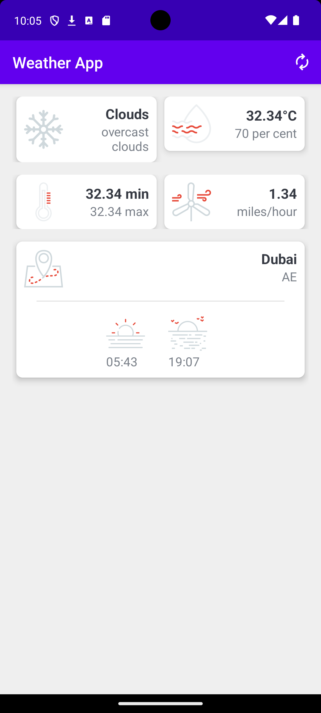
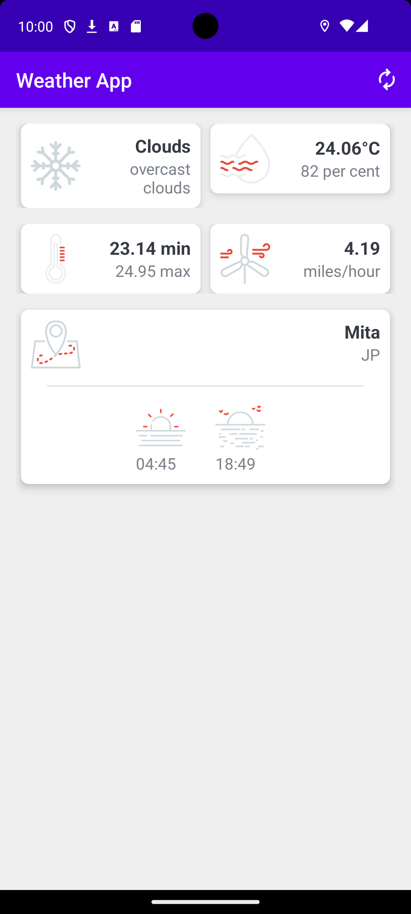

# 🌤️ Weather App - Android

A modern, responsive, and lightweight Android Weather application built with **Kotlin**, **Retrofit**, and **Google Play Location Services**. The app fetches real-time meteorological data for your current location using the **OpenWeatherMap API**, caches data locally for quick offline access, and presents it with an intuitive Material Design interface.

---

## 📸 Screenshots

| 🇦🇪 Weather in Dubai | 🇯🇵 Weather in Japan |
| :---: | :---: |
|  |  |

---

## ✨ Features

- 📍 **Real-Time Location Tracking**: Automatically detects the user's precise geographical location using Google's `FusedLocationProviderClient`.
- 🌡️ **Comprehensive Weather Metrics**:
  - Current Temperature (°C / °F depending on locale)
  - Min & Max Daily Temperature
  - Weather Conditions & Detailed Descriptions (e.g., Overcast Clouds, Rain, Clear Sky)
  - Humidity Percentage
  - Wind Speed (mph)
  - Location City Name & Country Code
- 🌅 **Accurate Sunrise & Sunset**: Dynamically converts and formats Unix timestamps based on the specific location's timezone offset.
- ⚡ **Offline Data Caching**: Saves the latest weather data locally using `SharedPreferences` and `Gson`, allowing users to view data even without an active internet connection.
- 🔄 **Manual Refresh**: Built-in ActionBar refresh menu button to re-fetch live location and weather data instantly.
- 🔒 **Secure API Key Storage**: Kept out of version control by passing API secrets safely through `local.properties` and Gradle `BuildConfig`.
- 🛡️ **Smooth Permission Handling**: Utilizes `Dexter` for seamless runtime location permissions (`ACCESS_FINE_LOCATION` & `ACCESS_COARSE_LOCATION`).

---

## 🛠️ Tech Stack & Libraries

- **Language**: [Kotlin](https://kotlinlang.org/)
- **UI & Layout**: Android ViewBinding, Material Design Components, ConstraintLayout
- **Networking**: [Retrofit 2](https://square.github.io/retrofit/) & [Gson Converter](https://github.com/google/gson)
- **Location Services**: `com.google.android.gms:play-services-location`
- **Permission Management**: [Dexter](https://github.com/Karumi/Dexter)
- **API Provider**: [OpenWeatherMap API](https://openweathermap.org/api)
- **Minimum SDK**: 24 (Android 7.0 Nougat)
- **Target SDK**: 36

---

## 📁 Project Structure

```text
WeatherApp/
├── app/
│   ├── src/
│   │   └── main/
│   │       ├── java/com/example/weatherapp/
│   │       │   ├── models/           # Data models (WeatherResponse, Main, Sys, Wind, etc.)
│   │       │   ├── network/          # Retrofit WeatherService interface
│   │       │   ├── Constants.kt      # Network status check & API configuration constants
│   │       │   └── MainActivity.kt   # Main UI, location listener & API logic
│   │       ├── res/                  # Layouts, icons, menus, and drawables
│   │       └── AndroidManifest.xml   # Permissions and activity setup
│   └── build.gradle.kts              # Module build configuration & dependencies
├── screenshots/                      # Application screenshots
├── gradle/                           # Version catalog (libs.versions.toml) & gradle wrapper
├── local.properties                  # Stores API keys locally (ignored by git)
└── README.md                         # Project documentation
```

---

## 🚀 Getting Started

### 📋 Prerequisites

- **Android Studio**: Ladybug / Jellyfish or newer
- **JDK**: Version 11 or higher
- **OpenWeatherMap API Key**: Free API key from [OpenWeatherMap](https://home.openweathermap.org/users/sign_up)

---

### 🔧 Setup Instructions

1. **Clone the Repository**
   ```bash
   git clone https://github.com/Sarthak-lrner/WeatherApp.git
   cd WeatherApp
   ```

2. **Configure your OpenWeatherMap API Key**
   Open or create the `local.properties` file in the root directory of the project, and add your API key:
   ```properties
   WEATHER_API_KEY=your_actual_openweathermap_api_key_here
   ```

3. **Open & Build Project**
   - Launch **Android Studio** and select `Open an existing project`.
   - Choose the `WeatherApp` directory.
   - Sync Gradle dependencies (`File -> Sync Project with Gradle Files`).

4. **Run the App**
   - Connect a physical Android device or start an Emulator with Google Play Services enabled.
   - Ensure Location Services (GPS) are enabled on the device.
   - Click **Run** (`Shift + F10`).

---

## 🔑 Permissions Requested

| Permission | Purpose |
| :--- | :--- |
| `ACCESS_FINE_LOCATION` | Required to get precise GPS coordinates for accurate weather fetching. |
| `ACCESS_COARSE_LOCATION` | Fallback approximate network-based location provider. |
| `INTERNET` | Required to perform HTTP requests to the OpenWeatherMap API. |
| `ACCESS_NETWORK_STATE` | Used to check active internet connection status before making API calls. |

